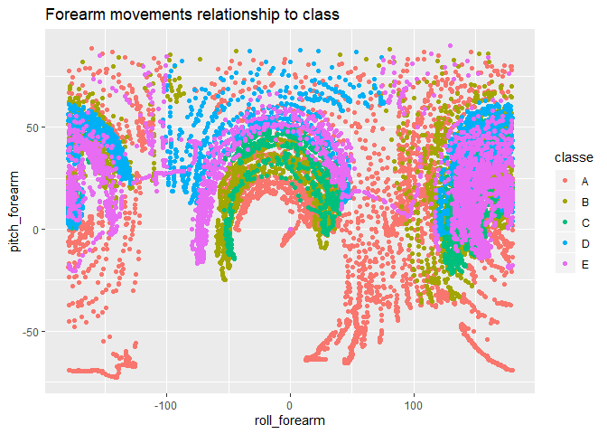
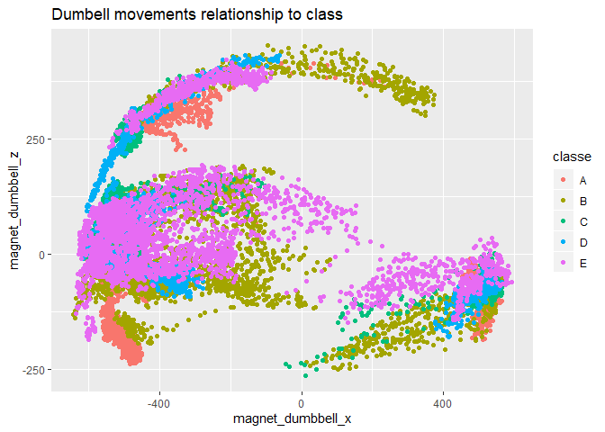

# Practical Machine Learning Course Project

## Background

People regularly quantify *how much* of a particular activity they do but they rarely quantify *how well* they perform it.
The approach of this study is to investigate the quality of weight-lifting exercise.

Read more from the original publication:

> Velloso, E.; Bulling, A.; Gellersen, H.; Ugulino, W.; Fuks, H. Qualitative Activity Recognition of Weight Lifting Exercises. Proceedings of 4th International Conference in Cooperation with SIGCHI (Augmented Human '13) . Stuttgart, Germany: ACM SIGCHI, 2013.

> http://groupware.les.inf.puc-rio.br/har


## Data 

Data includes measurements of 6 participants performing dumbbell lifts correctly and incorrectly in 5 different ways. Measurements where gathered from sensors on the belt, forearm, arm and dumbell.

First five rows of the first ten variables:


```r
pml <- read.csv("data/pml-training.csv")
pml[1:5,1:10]
```

```
##   X user_name raw_timestamp_part_1 raw_timestamp_part_2   cvtd_timestamp
## 1 1  carlitos           1323084231               788290 05/12/2011 11:23
## 2 2  carlitos           1323084231               808298 05/12/2011 11:23
## 3 3  carlitos           1323084231               820366 05/12/2011 11:23
## 4 4  carlitos           1323084232               120339 05/12/2011 11:23
## 5 5  carlitos           1323084232               196328 05/12/2011 11:23
##   new_window num_window roll_belt pitch_belt yaw_belt
## 1         no         11      1.41       8.07    -94.4
## 2         no         11      1.41       8.07    -94.4
## 3         no         11      1.42       8.07    -94.4
## 4         no         12      1.48       8.05    -94.4
## 5         no         12      1.48       8.07    -94.4
```

The total number of observations is 19622 over 160 variables.


```r
dim(pml)
```

```
## [1] 19622   160
```


## Goal

The goal of this project is to use machine learning methods for predicting the manner in which participants did the exercise.

The variable of interest is *classe*:


```r
table(pml$classe)
```

```
## 
##    A    B    C    D    E 
## 5580 3797 3422 3216 3607
```

## Data cleaning

The original dataset includes some variables that are extremely sparse. That means that most of the observations are either NA or empty. These features are dropped off. Also some irrelevant variables like id, timestamp and user name are removed.

The cleaned dataset includes 54 features.


```r
na_counts <- sapply(pml, function(x) sum(is.na(x)|x == ''))
na_counts <- data.frame(column = names(na_counts), na_count = na_counts, row.names = NULL)
columns_to_drop <- as.character(na_counts[na_counts$na_count > 0,'column'])
columns_to_drop <- c(columns_to_drop,
                     'X','user_name','raw_timestamp_part_1','raw_timestamp_part_2','cvtd_timestamp','new_window')
pml_cleaned <- pml[names(pml)[!names(pml) %in% columns_to_drop]]
dim(pml_cleaned)
```

```
## [1] 19622    54
```


## Exploring the data


```r
library(ggplot2)
```

Some graphical illustrations how measurements of different sensors relates to the manner in which the exercise was done.


```r
qplot(x = roll_forearm, y = pitch_forearm, colour = classe, data=pml_cleaned, 
      main = "Forearm movements relationship to class")
```

<!-- -->

```r
qplot(x = magnet_dumbbell_x, y = magnet_dumbbell_z, colour = classe, data=pml_cleaned,
      main = "Dumbell movements relationship to class")
```

<!-- -->

## Classification

The goal was to predict the manner in which the exercise was done (classe: A,B,C,D,E) using the measurement data of the sensors. The Random Forest method was chosen for this classification task because its capability of handle large number of possible noisy features. Simple decision trees where also tested but it turn out that random forest performs much better.

The training of the model was done with caret-package.

```r
library(caret)
```

```
## Loading required package: lattice
```

### Creating training and test datasets

75% of the data was used for model training and 25% was hold out for testing.


```r
set.seed(3856)
m <- length(pml_cleaned)
inTrain <- createDataPartition(pml_cleaned$classe, p = 3/4)[[1]]
x_train <- pml_cleaned[inTrain, 1:(m-1)]
y_train <- pml_cleaned[inTrain, m]
x_test <- pml_cleaned[-inTrain, 1:(m-1)]
y_test <- pml_cleaned[-inTrain, m]
```

### Training the model

For estimating the performance of the model on unseen data the method called cross-validation was used. In k-fold cross-validation data is splitted into k equal sized subsets. In turn each of these fold is used for validation and other (k-1) folds are used for model training. Finally the average model performance is calculated.

In this exercise 5-fold cross-validation was used:


```r
train_control <- trainControl(method="cv", number=5)
```

Finally the model was trained using random forest algorithm

```r
fit <- train(x_train, y_train, trControl = train_control, method = 'rf')
```

## Evaluating model performance

The average accuracy of the model was 99.7%. 


```r
confusionMatrix.train(fit)
```

```
## Cross-Validated (5 fold) Confusion Matrix 
## 
## (entries are percentual average cell counts across resamples)
##  
##           Reference
## Prediction    A    B    C    D    E
##          A 28.4  0.0  0.0  0.0  0.0
##          B  0.0 19.3  0.1  0.0  0.0
##          C  0.0  0.0 17.4  0.1  0.0
##          D  0.0  0.0  0.0 16.3  0.0
##          E  0.0  0.0  0.0  0.0 18.3
##                             
##  Accuracy (average) : 0.9971
```

The confusion matrix show that almost all training samples were classified correctly.


```r
fit$finalModel
```

```
## 
## Call:
##  randomForest(x = x, y = y, mtry = param$mtry) 
##                Type of random forest: classification
##                      Number of trees: 500
## No. of variables tried at each split: 27
## 
##         OOB estimate of  error rate: 0.23%
## Confusion matrix:
##      A    B    C    D    E  class.error
## A 4183    1    0    0    1 0.0004778973
## B    5 2838    4    1    0 0.0035112360
## C    0    6 2561    0    0 0.0023373588
## D    0    0    8 2403    1 0.0037313433
## E    0    0    0    7 2699 0.0025868441
```


### Performance on test set

The out of sample performance of the model was estimated using the hold out test set. The estimated accuracy of the model was 99.8% and respectively the estimated error rate was 0.2%.


```r
pred <- predict(fit, x_test)
confusionMatrix(y_test, pred)
```

```
## Confusion Matrix and Statistics
## 
##           Reference
## Prediction    A    B    C    D    E
##          A 1395    0    0    0    0
##          B    1  947    1    0    0
##          C    0    0  855    0    0
##          D    0    0    2  802    0
##          E    0    0    0    4  897
## 
## Overall Statistics
##                                           
##                Accuracy : 0.9984          
##                  95% CI : (0.9968, 0.9993)
##     No Information Rate : 0.2847          
##     P-Value [Acc > NIR] : < 2.2e-16       
##                                           
##                   Kappa : 0.9979          
##                                           
##  Mcnemar's Test P-Value : NA              
## 
## Statistics by Class:
## 
##                      Class: A Class: B Class: C Class: D Class: E
## Sensitivity            0.9993   1.0000   0.9965   0.9950   1.0000
## Specificity            1.0000   0.9995   1.0000   0.9995   0.9990
## Pos Pred Value         1.0000   0.9979   1.0000   0.9975   0.9956
## Neg Pred Value         0.9997   1.0000   0.9993   0.9990   1.0000
## Prevalence             0.2847   0.1931   0.1750   0.1644   0.1829
## Detection Rate         0.2845   0.1931   0.1743   0.1635   0.1829
## Detection Prevalence   0.2845   0.1935   0.1743   0.1639   0.1837
## Balanced Accuracy      0.9996   0.9997   0.9983   0.9973   0.9995
```

